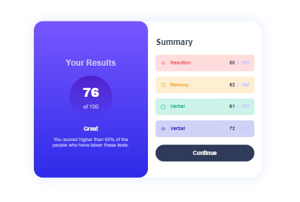

# Frontend Mentor - Results summary component solution

This is a solution to the [Results summary component challenge on Frontend Mentor](https://www.frontendmentor.io/challenges/results-summary-component-CE_K6s0maV). Frontend Mentor challenges help you improve your coding skills by building realistic projects. 

## Table of contents

- [Overview](#overview)
  - [The challenge](#the-challenge)
  - [Screenshot](#screenshot)
  - [Links](#links)
- [My process](#my-process)
  - [Built with](#built-with)
  - [What I learned](#what-i-learned)
  - [Continued development](#continued-development)
- [Author](#author)

## Overview

### The challenge

Users should be able to:

- View the optimal layout for the interface depending on their device's screen size
- See hover and focus states for all interactive elements on the page
- **Bonus**: Use the local JSON data to dynamically populate the content

### Screenshot



### Links

- Solution URL: [Solution](https://www.frontendmentor.io/solutions/result-summary-component-TdyfL5kl1w)
- Live Site URL: [Live site](https://github.com/BRENHINES/Results-summary-component-main.git)

## My process

### Built with

- Semantic HTML5 markup
- CSS custom properties
- SASS syntax
- Flexbox
- Mobile-first workflow


### What I learned

I learn how to properly use linear-gradient in a background. But also how to use box-shadow.

```css
background: linear-gradient(to bottom, color_1, color_2);
```
```css
box-shadow: x-direction y-direction shadow-width shadow-blur color;
```

### Continued development

I want to continous to focus on CSS especially in linear-gradient such as this one which i make.

## Author

- Frontend Mentor - [YOPA SEREINA](https://www.frontendmentor.io/profile/BRENHINES)
